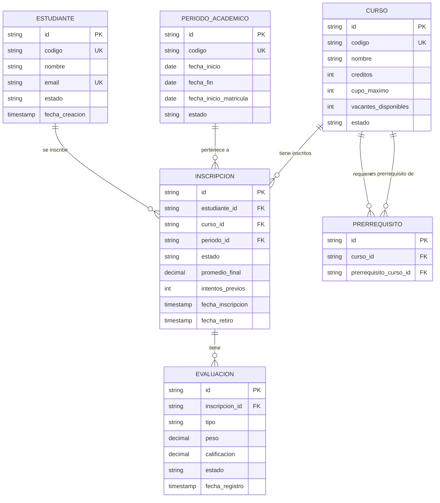
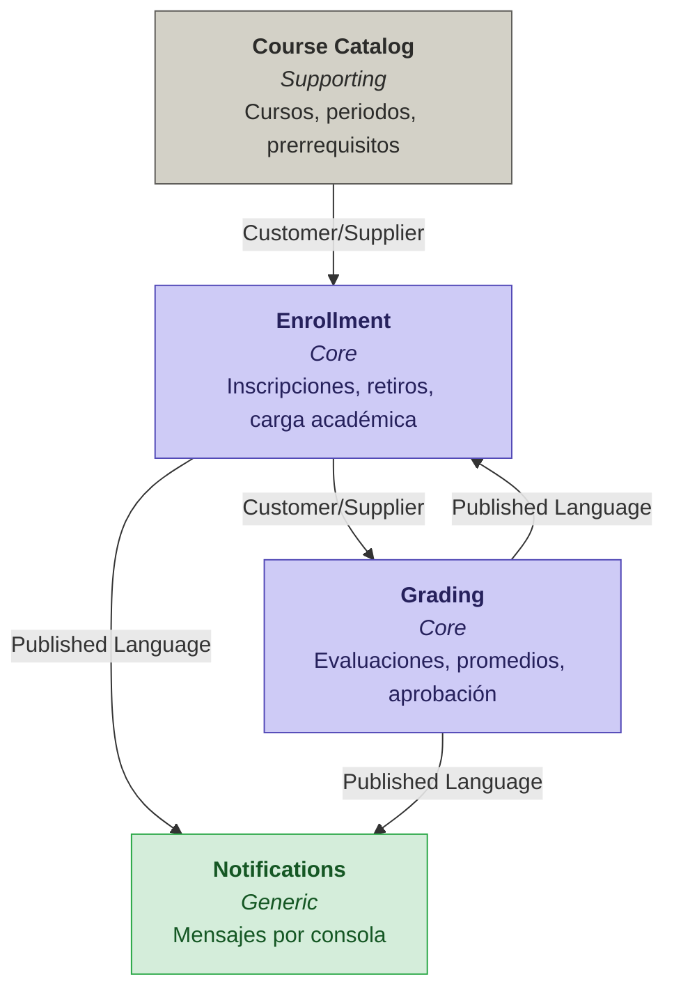

# Caso Resuelto — DDD aplicado a *Sistema de Gestión de Cursos Universitarios*

> **Curso:** Arquitectura de Software
> **Tema:** Domain-Driven Design + Event Storming
> **Dominio:** Sistema de Gestión de Cursos Universitarios
> **Tipo:** Caso resuelto — Caso 5

---

## Contexto del problema

Una universidad necesita un sistema para gestionar la **inscripción de estudiantes en cursos**, el **registro de calificaciones** y el **seguimiento del progreso académico**. El sistema debe validar prerrequisitos, controlar cupos, manejar retiros parciales y calcular promedios ponderados para determinar aprobación o reprobación.

### Requisitos funcionales

1. **Gestión de Cursos**
   - Crear curso (código, nombre, créditos, cupo máximo, prerrequisitos)
   - Abrir inscripciones para un periodo académico
   - Consultar cursos disponibles
   - Consultar vacantes disponibles por curso
2. **Operación Principal — Inscripciones**
   - Inscribir estudiante en curso
   - Validar prerrequisitos cumplidos
   - Validar cupo disponible
   - Validar carga académica máxima del estudiante
   - Retirar estudiante de curso (antes de fecha límite)
3. **Gestión de Evaluaciones**
   - Registrar calificación de evaluación (examen, trabajo, práctica)
   - Calcular promedio final del curso
   - Aprobar/Reprobar estudiante en curso
4. **Notificación Simple**
   - Notificar confirmación de inscripción
   - Notificar cuando falta cupo (lista de espera)
   - Notificar calificación final registrada
   - Notificar cuando reprueba un curso
   - Soportar 1 canal (consola)

> **Decisión de diseño global.** El alcance cubre los 4 requisitos funcionales. Extensiones futuras (pagos de matrícula, horarios y aulas, asistencia, credenciales digitales, múltiples canales de notificación) quedan documentadas como **fuera de alcance** en el Paso 1.

---

## Paso 1 — Identificar eventos del dominio

| Paso | Acción | Personas | Finalidad |
|---|---|---|---|
| 1.0 | Reunión de equipo | Desarrollo + Negocio | Identificar eventos del dominio según los requerimientos |

> **Nota pedagógica.** Los requisitos hablan de "inscribir estudiante" o "registrar calificación" — esos son **comandos**. El evento es lo que **ya ocurrió**: `EstudianteInscrito`, `CalificaciónRegistrada`. El Event Storming modela hechos consumados.

### Eventos identificados

| # | Evento (en pasado) | Alcance | Notas / Justificación |
|---|---|---|---|
| 1 | `CursoCreado` | Dentro | Req 1: crear curso con código, nombre, créditos, cupo y prerrequisitos |
| 2 | `PrerrequisitosAsignados` | Dentro | Req 1: un curso puede tener 0, 1 o múltiples prerrequisitos |
| 3 | `InscripcionesAbiertas` | Dentro | Req 1: abrir inscripciones para un periodo académico |
| 4 | `VacantesConsultadas` | Dentro | Req 1: consultar vacantes disponibles por curso |
| 5 | `PrerrequisitosValidados` | Dentro | Req 2: validar que el estudiante aprobó todos los prerrequisitos con nota ≥ 11 |
| 6 | `CupoValidado` | Dentro | Req 2: verificar que el curso no excede su cupo máximo |
| 7 | `CargaAcadémicaValidada` | Dentro | Req 2: validar máximo 6 cursos / 24 créditos por ciclo |
| 8 | `EstudianteInscrito` | Dentro | Req 2: resultado exitoso de la inscripción |
| 9 | `InscripciónRechazada` | Dentro | Req 2: falla por prerrequisitos, cupo, carga o doble inscripción |
| 10 | `EstudianteRetirado` | Dentro | Req 2: retiro antes de semana 8 |
| 11 | `RetiroSinHistorial` | Dentro | Regla: retiro antes de semana 4 no aparece en historial |
| 12 | `RetiroConMarcaRegistrado` | Dentro | Regla: retiro entre semana 4-8 aparece como "R" |
| 13 | `RetiroRechazado` | Dentro | Regla: después de semana 8 no se permite retiro |
| 14 | `CalificaciónRegistrada` | Dentro | Req 3: registrar nota de evaluación (examen, trabajo, participación) |
| 15 | `PromedioFinalCalculado` | Dentro | Req 3: calcular promedio ponderado (60% exámenes, 30% trabajos, 10% participación) |
| 16 | `EstudianteAprobado` | Dentro | Req 3: nota final ≥ 11 |
| 17 | `EstudianteReprobado` | Dentro | Req 3: nota final < 11 |
| 18 | `ObservaciónAcadémicaAplicada` | Dentro | Regla: más de 2 cursos reprobados en un ciclo → observación |
| 19 | `AutorizaciónEspecialRequerida` | Dentro | Regla: tercer intento de un curso reprobado 2 veces necesita autorización |
| 20 | `NotificaciónEnviada` | Dentro | Req 4: notificaciones por consola |
| 21 | `EstudianteEnListaDeEspera` | Dentro | Req 4: notificar cuando falta cupo |
| 22 | `PagoDeMatrículaProcesado` | Fuera | No es parte del alcance actual |
| 23 | `HorarioAsignado` | Fuera | No se gestiona horarios ni aulas |
| 24 | `AsistenciaRegistrada` | Fuera | No es parte del alcance actual |
| 25 | `NotificaciónPorEmailEnviada` | Fuera | Solo canal consola en el MVP |

---

## Paso 2 — Identificar subdominios

| Paso | Acción | Personas | Finalidad |
|---|---|---|---|
| 2.0 | Reunión de equipo | Desarrollo + Negocio | Agrupar eventos en subdominios |

### Subdominios identificados

| Subdominio | Tipo | Eventos asociados | Notas |
|---|---|---|---|
| **Gestión de Cursos** | Supporting | `CursoCreado`, `PrerrequisitosAsignados`, `InscripcionesAbiertas`, `VacantesConsultadas` | Define la oferta académica. Apoya al Core pero no diferencia al sistema — cualquier universidad tiene catálogo de cursos |
| **Inscripciones** | Core | `PrerrequisitosValidados`, `CupoValidado`, `CargaAcadémicaValidada`, `EstudianteInscrito`, `InscripciónRechazada`, `EstudianteRetirado`, `RetiroSinHistorial`, `RetiroConMarcaRegistrado`, `RetiroRechazado`, `AutorizaciónEspecialRequerida`, `EstudianteEnListaDeEspera` | Es el **corazón del sistema**: aquí viven las reglas de negocio más complejas (prerrequisitos, cupos, retiros, autorizaciones especiales). La mayor inversión de modelado y testing va aquí |
| **Evaluaciones** | Core | `CalificaciónRegistrada`, `PromedioFinalCalculado`, `EstudianteAprobado`, `EstudianteReprobado`, `ObservaciónAcadémicaAplicada` | Determina el progreso académico. Tiene reglas de ponderación y afecta directamente al historial del estudiante |
| **Notificaciones** | Generic | `NotificaciónEnviada` | Commodity: enviar mensajes por consola. Podría reemplazarse por un servicio externo sin afectar al dominio |

> **Decisión.** 2 subdominios Core (Inscripciones y Evaluaciones), 1 Supporting (Gestión de Cursos) y 1 Generic (Notificaciones). El esfuerzo de diseño se concentra en los Core, donde están las reglas de negocio más ricas.

---

## Paso 3 — Lenguaje Ubicuo (Ubiquitous Language)

| Paso | Acción | Personas | Finalidad |
|---|---|---|---|
| 3.0 | Reunión de equipo | Desarrollo + Negocio | Construir el glosario común del negocio |

### Glosario del negocio

| Término | Definición | Estados | Reglas / Invariantes |
|---|---|---|---|
| **Estudiante** | Persona matriculada en la universidad que puede inscribirse en cursos y recibir calificaciones. | `REGULAR`, `OBSERVACIÓN_ACADÉMICA` | Máximo 6 cursos por ciclo; máximo 24 créditos por ciclo. Si reprueba más de 2 cursos en un ciclo → pasa a Observación |
| **Curso** | Asignatura ofertada por la universidad con un código único, créditos y cupo máximo. | `ACTIVO`, `CERRADO` | Cupo máximo no puede excederse; puede tener 0 o más prerrequisitos |
| **Periodo Académico** | Ciclo lectivo de 16 semanas con fechas de inicio y fin definidas. | `MATRÍCULA_ABIERTA`, `EN_CURSO`, `FINALIZADO` | Matrícula abierta = 15 días antes del inicio de clases |
| **Inscripción** | Registro de un estudiante en un curso específico dentro de un periodo. | `ACTIVA`, `RETIRADA_SIN_HISTORIAL`, `RETIRADA_CON_MARCA`, `APROBADA`, `REPROBADA` | No puede duplicarse (mismo estudiante + curso + periodo); requiere prerrequisitos aprobados; requiere cupo disponible |
| **Prerrequisito** | Curso que un estudiante debe haber aprobado (nota ≥ 11) antes de inscribirse en otro curso. | — | Se validan TODOS automáticamente al momento de la inscripción |
| **Evaluación** | Instancia de calificación dentro de un curso. Tipos: Examen, Trabajo, Participación. | `PENDIENTE`, `CALIFICADA` | Pesos: Exámenes 60%, Trabajos 30%, Participación 10% |
| **Calificación** | Nota numérica de 0 a 20 asignada a una evaluación. | — | Valor entre 0 y 20 (inclusive). Inmutable una vez registrada |
| **Promedio Final** | Resultado ponderado de todas las calificaciones de un estudiante en un curso. | — | Calculado automáticamente. Nota mínima aprobatoria = 11 |
| **Retiro** | Acción de un estudiante de abandonar un curso inscrito. | `SIN_HISTORIAL` (antes semana 4), `CON_MARCA_R` (semana 4-8) | No permitido después de semana 8 |
| **Lista de Espera** | Registro de estudiantes que desean un curso que alcanzó su cupo máximo. | — | Se notifica al estudiante. Ingresa si se libera un cupo |
| **Autorización Especial** | Permiso requerido cuando un estudiante intenta inscribirse por tercera vez en un curso que reprobó 2 veces. | `PENDIENTE`, `APROBADA`, `RECHAZADA` | Sin autorización aprobada → inscripción rechazada |
| **Observación Académica** | Estado disciplinario que se aplica al estudiante que reprueba más de 2 cursos en un ciclo. | — | Se evalúa al finalizar el ciclo |
| **Carga Académica** | Conjunto de cursos y créditos que un estudiante cursa en un periodo. | — | Máximo 6 cursos y 24 créditos por periodo |

> **Nota pedagógica.** Este glosario **vive en el código**. Si en el código aparece `EnrollmentManager.checkSeats()` en lugar de `Inscripción.validarCupo()`, se rompió el Lenguaje Ubicuo.

---

## Paso 4 — Modelo táctico

| Paso | Acción | Personas | Finalidad |
|---|---|---|---|
| 4.0 | Reunión de equipo | Desarrollo + Negocio | Identificar entidades, objetos de valor, agregados y relaciones |

### 4.A — Entidades

| Entidad | Atributos clave | Relaciones | Notas |
|---|---|---|---|
| **Estudiante** | `id`, `código`, `nombre`, `email`, `estado` | 1 : N con `Inscripción` | Raíz de su propio agregado. Controla la carga académica |
| **Curso** | `id`, `código`, `nombre`, `créditos`, `cupoMáximo`, `vacantesDisponibles` | N : M con `Prerrequisito` (auto-relación); 1 : N con `Inscripción` | Raíz de su agregado. Custodia el cupo |
| **PeriodoAcadémico** | `id`, `código`, `fechaInicio`, `fechaFin`, `fechaInicioMatrícula`, `estado` | 1 : N con `Inscripción` | Define el marco temporal del ciclo |
| **Inscripción** | `id`, `estudianteId`, `cursoId`, `periodoId`, `estado`, `semanaActual` | N : 1 con `Estudiante`, `Curso`, `PeriodoAcadémico`; 1 : N con `Evaluación` | Raíz de su agregado. Concentra las reglas de inscripción y retiro |
| **Evaluación** | `id`, `inscripciónId`, `tipo`, `peso`, `calificación`, `estado` | N : 1 con `Inscripción` | Parte del agregado de Inscripción |

### 4.B — Objetos de Valor

| Objeto de Valor | Atributos | Descripción / Uso |
|---|---|---|
| **Calificación** | `valor` (decimal 0-20) | Nota numérica inmutable. Se valida que esté en rango 0-20 |
| **CargaAcadémica** | `totalCursos`, `totalCréditos` | Representa la carga actual del estudiante en un periodo. Máximo 6 cursos / 24 créditos |
| **RangoDeSemanas** | `semanaInicio`, `semanaFin` | Define ventanas de tiempo para retiros (0-4, 4-8, 8-16) |
| **PesoPonderado** | `tipoEvaluación`, `porcentaje` | Examen=60%, Trabajo=30%, Participación=10%. Inmutable por curso |
| **PromedioFinal** | `valor` (decimal 0-20) | Resultado del cálculo ponderado. Determina aprobación (≥ 11) o reprobación (< 11) |
| **CódigoCurso** | `string` | Identificador único del curso en el catálogo académico |
| **Email** | `string` validado | Identificador de contacto del estudiante |

### 4.C — Agregados

| Agregado (raíz) | Miembros incluidos | Invariantes |
|---|---|---|
| **Estudiante** | `Email`, `CargaAcadémica`, `estado` | Email único; carga académica ≤ 6 cursos y ≤ 24 créditos por periodo; estado cambia a `OBSERVACIÓN_ACADÉMICA` si reprueba > 2 cursos en un ciclo |
| **Curso** | `CódigoCurso`, `PesoPonderado`, prerrequisitos, cupo | Código único; vacantes ≥ 0 y ≤ cupoMáximo; créditos > 0 |
| **PeriodoAcadémico** | `RangoDeSemanas`, fechas | Fechas coherentes (inicio < fin); matrícula abierta solo 15 días antes del inicio |
| **Inscripción** | `Evaluación[]`, `Calificación[]`, `PromedioFinal`, estado | No duplicar (estudiante + curso + periodo); prerrequisitos aprobados; estado sigue máquina: `ACTIVA` → `RETIRADA_*` / `APROBADA` / `REPROBADA`; retiro solo permitido antes de semana 8; promedio final se calcula solo cuando todas las evaluaciones están calificadas |

> **Regla de oro de agregados.** La `Inscripción` **no modifica directamente** las vacantes del `Curso`. Le envía un comando (`reservarVacante`) y el curso responde con un evento (`CupoValidado` o `CupoAgotado`). Tampoco modifica directamente al `Estudiante`; emite `EstudianteReprobado` y el agregado Estudiante decide si aplica observación académica. Esto preserva la consistencia de cada agregado.

### 4.D — Diagrama E/R derivado del modelo táctico

> Cada agregado raíz se materializa como una tabla. Los objetos de valor viven como columnas dentro de la tabla del agregado que los contiene.

---

## Paso 5 — Bounded Contexts + Context Map

| Paso | Acción | Personas | Finalidad |
|---|---|---|---|
| 5.0 | Reunión de equipo | Desarrollo + Negocio | Delimitar Bounded Contexts y trazar el Context Map |

> **Decisión.** Para este alcance, **4 Bounded Contexts** reflejan las fronteras naturales del dominio. Si el sistema sumara gestión de pagos, horarios o asistencia, esos serían nuevos contextos.

### 5.A — Lista de Bounded Contexts

| Bounded Context | Tipo | Agregado(s) raíz | Eventos / Acciones que cubre | Subdominios absorbidos |
|---|---|---|---|---|
| **Course Catalog** | Supporting | `Curso`, `PeriodoAcadémico` | `CursoCreado`, `PrerrequisitosAsignados`, `InscripcionesAbiertas`, `VacantesConsultadas` | Gestión de Cursos |
| **Enrollment** | Core | `Inscripción`, `Estudiante` (parcial: carga académica) | `PrerrequisitosValidados`, `CupoValidado`, `CargaAcadémicaValidada`, `EstudianteInscrito`, `InscripciónRechazada`, `EstudianteRetirado`, `RetiroSinHistorial`, `RetiroConMarcaRegistrado`, `RetiroRechazado`, `AutorizaciónEspecialRequerida`, `EstudianteEnListaDeEspera` | Inscripciones |
| **Grading** | Core | `Inscripción` (parcial: evaluaciones y promedio) | `CalificaciónRegistrada`, `PromedioFinalCalculado`, `EstudianteAprobado`, `EstudianteReprobado`, `ObservaciónAcadémicaAplicada` | Evaluaciones |
| **Notifications** | Generic | `Notificación` | `NotificaciónEnviada` | Notificaciones |

### 5.B — Context Map (relaciones)

| Upstream (provee) | Downstream (consume) | Patrón | Qué se intercambia | Notas |
|---|---|---|---|---|
| Course Catalog | Enrollment | **Customer / Supplier** | Datos del curso (créditos, cupo, prerrequisitos); comando `reservarVacante`; evento `CupoValidado` / `CupoAgotado` | Enrollment es cliente del catálogo; Course Catalog prioriza las necesidades de Enrollment (cupos, prerrequisitos) |
| Enrollment | Grading | **Customer / Supplier** | Evento `EstudianteInscrito` (con inscripciónId, cursoId, estudianteId); lista de evaluaciones del curso | Grading necesita saber qué estudiantes están inscritos para registrar calificaciones. Enrollment provee esa información |
| Grading | Enrollment | **Published Language** | Evento `EstudianteAprobado` / `EstudianteReprobado` (con inscripciónId, nota final) | Enrollment consume estos eventos para actualizar el historial académico del estudiante (afecta validación de prerrequisitos futuros y conteo de reprobaciones) |
| Grading | Notifications | **Published Language** | Eventos `CalificaciónRegistrada`, `EstudianteReprobado`, `PromedioFinalCalculado` | Bus de eventos; Notifications no conoce a Grading, solo el contrato del evento |
| Enrollment | Notifications | **Published Language** | Eventos `EstudianteInscrito`, `InscripciónRechazada`, `EstudianteEnListaDeEspera` | Bus de eventos; Notifications consume y envía por consola |

### 5.C — Diagrama del Context Map

### 5.D — Glosario de patrones de integración (referencia rápida)

| Patrón | Cuándo aplica |
|---|---|
| **Partnership** | Dos contextos colaboran estrechamente y evolucionan juntos. Mismo destino. |
| **Shared Kernel** | Comparten un subconjunto del modelo. Cambios requieren acuerdo de ambos equipos. |
| **Customer / Supplier** | Upstream prioriza necesidades del downstream. Relación de servicio. |
| **Conformist** | Downstream adopta el modelo del upstream tal cual, sin traducción. |
| **Anti-Corruption Layer (ACL)** | Downstream traduce el modelo upstream para protegerse de su forma. |
| **Open Host Service (OHS)** | Upstream expone una API estándar pensada para múltiples consumidores. |
| **Published Language** | Lenguaje común publicado (ej. eventos de dominio en un bus). |
| **Separate Ways** | Sin integración. Cada contexto resuelve por su cuenta. |

---

